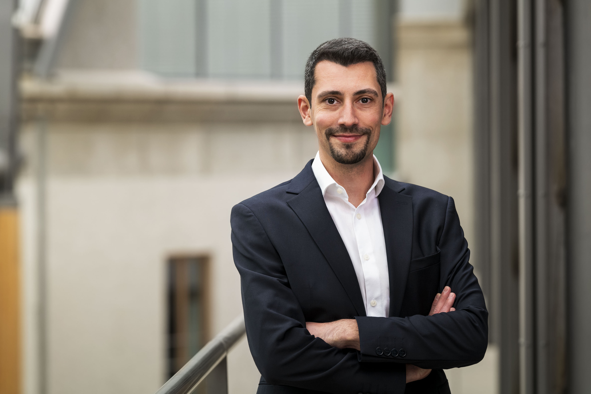

```{=html}
<style>
body {
  max-width: 990px;
  margin: auto;
  font-family: system-ui, -apple-system, Segoe UI, Roboto, sans-serif;
}

/* HERO FRAME — now tinted, not plain white */
.hero {
  display: flex;
  align-items: center;
  gap: 2.8rem;
  margin-top: 3.5rem;
  margin-bottom: 1.5rem;
  padding: 2.2rem;
  border-radius: 20px;

  /* softer academic-blue tint */
  background: linear-gradient(135deg, #eef3fb, #ffffff);

  box-shadow: 0 12px 35px rgba(0,0,0,0.06);
}

/* PROFILE IMAGE */
.hero img {
  width: 330px;
  height: 330px;
  object-fit: cover;
  border-radius: 24px;
  border: 3px solid rgba(255,255,255,0.95);
  box-shadow: 0 18px 50px rgba(0,0,0,0.15);
  transition: all 0.25s ease;
}

.hero img:hover {
  transform: scale(1.03) rotate(-0.5deg);
}

/* TEXT BLOCK */
.identity {
  flex: 1;
  font-family: "Courier New", Courier, monospace;
}

/* NAME — still readable, slightly softened bold */
.name {
  font-size: 2.5rem;
  font-weight: 600;
  letter-spacing: -0.2px;
  margin-bottom: 0.25rem;
  color: #111;
  font-family: "Courier New", Courier, monospace;
}

/* ROLE */
.role {
  font-size: 1.1rem;
  color: #444;
  margin-bottom: 1rem;
  font-family: "Courier New", Courier, monospace;
}

/* TAGLINE — main “daktilo feel” */
.tagline {
  font-size: 1.02rem;
  color: #444;
  max-width: 560px;
  line-height: 1.65;
  white-space: pre-line;
  font-family: "Courier New", Courier, monospace;
  margin-bottom: -0.3rem;   /* reduce space after the tagline text */
}

.tagline .links {
  margin-top: -1.8rem;      /* tighten distance to links */
}
``

/* LINKS */

.links {
  display: flex;
  flex-wrap: wrap;
  gap: 0.6rem;
  margin-top: 0.8rem;
  padding: 0 2rem 2rem 2rem;
}

.links a {
  display: inline-block;
  text-decoration: none;
  padding: 1px 3px;
  border-radius: 12px;
  background: #f2f2f2;
  margin-right: 0.4rem;
  border: 1px solid #e6e6e6;
  color: black;
  font-weight: 450;
  transition: all 0.15s ease;
  box-shadow: 0 4px 10px rgba(0,0,0,0.04);
}

.links a:hover {
  transform: translateY(-1px);
  border-color: #cfdcf0;
  background: #f6f9ff;
}

/* MOBILE */
@media (max-width: 800px) {
  .hero {
    flex-direction: column;
    text-align: center;
  }

  .hero img {
    width: 220px;
    height: 220px;
  }

  .tagline {
    margin: auto;
  }

  .links {
    justify-content: center;
  }
}


/* =========================================================
   GLOBAL TYPOGRAPHY — ABSOLUTE CONSISTENCY
   ========================================================= */
body,
.identity,
.name,
.role,
.tagline {
  font-family: system-ui, -apple-system, "Segoe UI", Roboto, sans-serif;
}

/* =========================================================
   SECTION HEADINGS — SAME SIZE, SAME SPACING
   ========================================================= */
h2 {
  font-size: 1.6rem;
  font-weight: 600;
  margin-top: 3rem;
  margin-bottom: 1.3rem;
}

/* =========================================================
   PARAGRAPH TEXT — CONSISTENT RHYTHM
   ========================================================= */
p {
  font-size: 1rem;
  line-height: 1.65;
  margin-bottom: 1rem;
}

/* =========================================================
   RESEARCH AREAS — MATCH PARAGRAPH WEIGHT
   ========================================================= */
details {
  margin-bottom: 0.8rem;
}

summary {
  font-weight: 500;
  cursor: pointer;
}

details p {
  margin-top: 0.5rem;
}

/* =========================================================
   EDUCATION TABLE — SAME VISUAL LEVEL AS TEXT
   ========================================================= */
table {
  width: 100%;
  font-size: 1rem;
  margin-top: 0.5rem;
}

th {
  font-weight: 600;
}

td {
  vertical-align: top;
  padding: 0.4rem 0.6rem;
}

td:first-child {
  width: 80px;
  color: #666;
  font-weight: 500;
}


</style>
```

:::::::: hero


::::::: identity
::: name
Burak Giray, Ph.D.
:::

::: role
Postdoctoral Researcher · TU Munich
:::

:::: tagline
I study international organizations, civil war dynamics, and peacekeeping— focusing on when and how interventions work on the ground.

::: links
<a href="https://scholar.google.com/citations?user=SWWelg8AAAAJ&hl=en">🎓 Google Scholar</a> <a href="https://orcid.org/0000-0002-3398-0901">🆔 ORCID</a> <a href="https://x.com/Burak92Giray">🐦 Twitter / X</a> <a href="https://bsky.app/profile/bgiray.bsky.social">🦋 Bluesky</a> <a href="https://www.linkedin.com/in/burak-giray-373205368">💼 LinkedIn</a> <a href="cv.pdf">📄 CV</a>
:::
::::
:::::::
::::::::

## About

I am a Postdoctoral Researcher at the Munich School of Politics and Public Policy (Hochschule für Politik) at the Technical University of Munich.

My research examines the effectiveness of international organizations in conflict settings, with a particular focus on UN peacekeeping. I use quantitative and experimental methods to study how political incentives, local legitimacy, and troop-contributing country behavior shape peacekeeping outcomes.

Previously, as a DAAD PRIME Fellow (2023–2024), I held positions at the Hertie School and Uppsala University. The fellowship enabled me to develop an original dataset tracking field-level peacekeeping activities across missions, allowing for more fine-grained analysis of how mandates are implemented and how peacekeepers influence conflict dynamics and local support.

I received my Ph.D. in Political Science from the University of Houston. My dissertation, *"UN Peacekeeping Operations: Conflicting Interests and Effectiveness"*, examines how troop-contributing countries’ motivations shape mission outcomes and can undermine impartiality and civilian protection.

## Research Areas

<details>

<summary><strong>International Organizations and Global Governance</strong></summary>

Political behavior, institutional design, and effectiveness of international organizations, with a focus on UN‑based institutions. Emphasis on cooperation problems, mandate implementation, and the role of local and external legitimacy in shaping state behavior and support for multilateral governance.

</details>

<details>

<summary><strong>Civil War and Post‑Conflict Dynamics</strong></summary>

Onset, violence, and post‑conflict trajectories of intrastate wars, with emphasis on external intervention, local support, and institutional engagement in shaping conflict outcomes.

</details>

<details>

<summary><strong>UN Peacekeeping</strong></summary>

Effectiveness, legitimacy, and operational dynamics of UN peacekeeping missions, including troop-contributing country behavior and civilian protection outcomes.

</details>

<details>

<summary><strong>Research Methods</strong></summary>

Experimental design, panel data analysis, time‑series methods, difference‑in‑differences, interrupted time‑series designs, and causal mediation analysis.

</details>

## Education

| Year | Degree |
|----|----|
| 2022 | **Ph.D. in Political Science** (major: International Relations; minor: Comparative Politics), University of Houston, Texas, United States |
| 2016 | **M.A. in International Relations**, Social Sciences University of Ankara, Ankara, Turkey |
| 2014 | **B.A. in Translation Studies & Political Science**, Çankaya University, Ankara, Turkey |
