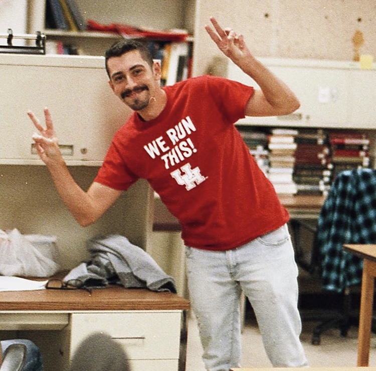

```{=html}
<style>

/* =========================================================
   GLOBAL LAYOUT (SAFE)
   ========================================================= */

/* ✅ restore navbar spacing */
body {
  margin: 0;
  padding-top: 80px;   /* slightly larger = safer */
}

/* ✅ content width */
#quarto-content main {
  max-width: 1040px;
  margin: auto;
  padding: 0 1.8rem;
}

/* =========================================================
   ✅ NAVBAR PROTECTION (CRITICAL FIX)
   ========================================================= */

/* ✅ DO NOT override Bootstrap layout */
.navbar {
  min-height: 70px;
  padding-top: 0.6rem;
  padding-bottom: 0.6rem;
}


/* ✅ prevent your styles from breaking navbar */
.navbar h1,
.navbar h2,
.navbar h3,
.navbar h4,
.navbar h5,
.navbar p {
  all: unset;
}

/* =========================================================
   HERO BUSINESS CARD
   ========================================================= */

.hero-card {
  display: grid;
  grid-template-columns: 300px 1fr 220px;
  gap: 2.3rem;
  align-items: center;
  width: 100%;

  padding: 2.2rem;

  background:
    linear-gradient(
      115deg,
      #fbfbfa 0%,
      #f7f8fa 56%,
      #eef2f7 56%,
      #f4f6f9 100%
    );

  border: 1px solid #d7dde7;
  border-radius: 18px;

  box-shadow:
    0 14px 34px rgba(0,0,0,0.06);
}

/* =========================================================
   PHOTO
   ========================================================= */

.hero-photo img {
  width: 100%;
  aspect-ratio: 1 / 1;
  object-fit: cover;
  display: block;
  border-radius: 14px;

  box-shadow: 0 12px 28px rgba(0,0,0,0.14);

  transition:
    transform 0.35s ease,
    box-shadow 0.35s ease,
    filter 0.35s ease;
}

.hero-photo img:hover {
  transform:
    scale(1.08)
    translateY(-4px)
    rotateZ(-0.4deg);

  box-shadow: 0 20px 45px rgba(0,0,0,0.2);
  filter: brightness(1.03);

  animation: subtleShake 0.6s ease-in-out;
}

@keyframes subtleShake {
  0%   { transform: scale(1.04) translateY(-4px) rotateZ(-0.4deg); }
  25%  { transform: scale(1.04) translateY(-4px) rotateZ(0.4deg); }
  50%  { transform: scale(1.04) translateY(-4px) rotateZ(-0.3deg); }
  75%  { transform: scale(1.04) translateY(-4px) rotateZ(0.3deg); }
  100% { transform: scale(1.04) translateY(-4px) rotateZ(-0.4deg); }
}

/* =========================================================
   MAIN IDENTITY
   ========================================================= */

.hero-main {
  padding-right: 1.5rem;
  border-right: 1px solid #cfd7e3;
}

.name {
  font-size: 4rem;
  font-weight: 700;
  line-height: 0.98;
  color: #12284a;
  margin-bottom: 0.9rem;
  font-family: Georgia, serif;
}

.role {
  font-size: 1.08rem;
  color: #4b5a70;
  margin-bottom: 1.7rem;
  font-weight: 500;
}

.tagline {
  font-size: 1.08rem;
  line-height: 1.95;
  color: #2b2b2b;
  max-width: 680px;
}

/* =========================================================
   CONNECT PANEL
   ========================================================= */

.hero-side {
  padding-left: 0.3rem;
}

.connect-title {
  font-size: 0.92rem;
  letter-spacing: 0.15em;
  text-transform: uppercase;
  font-weight: 700;
  color: #294c7a;
  margin-bottom: 1.4rem;
}

/* =========================================================
   LINKS
   ========================================================= */

.hero-links {
  display: flex;
  flex-direction: column;
  gap: 1rem;
}

.hero-links a {
  display: flex;
  justify-content: space-between;
  align-items: center;

  padding-bottom: 0.75rem;
  border-bottom: 1px solid #ccd4df;

  text-decoration: none;
  color: #183b63;
  font-size: 1rem;

  transition: opacity 0.15s ease;
}

.hero-links a:hover {
  opacity: 0.7;
}

/* =========================================================
   ✅ SCOPED TYPOGRAPHY (FIX)
   ========================================================= */

main h2 {
  font-size: 1.6rem;
  font-weight: 700;
  color: #17335c;
  margin-top: 3rem;
  margin-bottom: 1rem;
  font-family: Georgia, serif;
}

main p {
  font-size: 1rem;
  line-height: 1.85;
  margin-bottom: 1rem;
}

/* =========================================================
   DETAILS
   ========================================================= */

main details {
  margin-bottom: 0.9rem;
  border: 1px solid #e4e7ec;
  border-radius: 8px;
  background: #fafbfc;
  padding: 0.8rem 1rem;
}

main summary {
  cursor: pointer;
  font-weight: 600;
  color: #1f2f46;
}

/* =========================================================
   TABLE
   ========================================================= */

main table {
  width: 100%;
  font-size: 1rem;
  margin-top: 0.8rem;
}

main th {
  text-align: left;
  font-weight: 600;
  border-bottom: 1px solid #d9dee7;
}

main td {
  padding: 0.7rem 0.5rem;
  border-bottom: 1px solid #f0f1f3;
}

main td:first-child {
  width: 90px;
  color: #666;
  font-weight: 500;
}

/* =========================================================
   MOBILE
   ========================================================= */

@media (max-width: 980px) {

  #quarto-content main {
    padding: 0 1.2rem;
  }

  .hero-card {
    grid-template-columns: 1fr;
    padding: 2rem;
  }

  .hero-main {
    border-right: none;
    border-bottom: 1px solid #d9dee7;
    padding-right: 0;
    padding-bottom: 1.5rem;
  }

  .hero-side {
    padding-left: 0;
  }

  .hero-photo img {
    max-width: 240px;
  }

  .name {
    font-size: 2.8rem;
  }
}

/* =========================================================
   HERO SLIDER (NEW — wraps business card + news slides)
   ========================================================= */

.hero-slider {
  position: relative;
  margin-top: 3.8rem;
  margin-bottom: 3.2rem;
}

.hero-slider-track {
  overflow: hidden;
}

.hero-slider-slides {
  display: flex;
  align-items: stretch;
  transition: transform 0.45s ease;
}

.hero-slide {
  flex: 0 0 100%;
  max-width: 100%;
  display: flex;
}

/* news slides reuse the same card shell as the business card,
   just with a simpler single-column layout */
.news-card {
  padding: 2.2rem;
  width: 100%;

  background:
    linear-gradient(
      115deg,
      #fbfbfa 0%,
      #f7f8fa 56%,
      #eef2f7 56%,
      #f4f6f9 100%
    );

  border: 1px solid #d7dde7;
  border-radius: 18px;

  box-shadow:
    0 14px 34px rgba(0,0,0,0.06);

  display: flex;
  flex-direction: column;
  justify-content: center;
}

.news-eyebrow {
  font-size: 0.85rem;
  letter-spacing: 0.15em;
  text-transform: uppercase;
  font-weight: 700;
  color: #294c7a;
  margin-bottom: 1rem;
}

.news-title {
  font-size: 1.9rem;
  font-weight: 700;
  color: #12284a;
  margin-bottom: 0.9rem;
  font-family: Georgia, serif;
  line-height: 1.15;
}

.news-body {
  font-size: 1.05rem;
  line-height: 1.85;
  color: #2b2b2b;
  max-width: 720px;
}

.news-meta {
  margin-top: 1.2rem;
  font-size: 0.92rem;
  color: #4b5a70;
}

.news-meta a {
  color: #183b63;
  text-decoration: none;
  border-bottom: 1px solid #ccd4df;
}

.news-meta a:hover {
  opacity: 0.7;
}

/* arrows */
.hero-slider-arrow {
  position: absolute;
  top: 50%;
  transform: translateY(-50%);

  width: 44px;
  height: 44px;

  display: flex;
  align-items: center;
  justify-content: center;

  background: #ffffff;
  border: 1px solid #d7dde7;
  border-radius: 50%;

  box-shadow: 0 8px 18px rgba(0,0,0,0.1);

  cursor: pointer;
  color: #17335c;
  font-size: 1.1rem;
  user-select: none;

  transition: opacity 0.15s ease, transform 0.15s ease;
  z-index: 5;
}

.hero-slider-arrow:hover {
  opacity: 0.75;
}

.hero-slider-arrow.prev {
  left: -22px;
}

.hero-slider-arrow.next {
  right: -22px;
}

/* dots */
.hero-slider-dots {
  display: flex;
  justify-content: center;
  gap: 0.5rem;
  margin-top: 1.1rem;
}

.hero-slider-dot {
  width: 8px;
  height: 8px;
  border-radius: 50%;
  background: #d7dde7;
  cursor: pointer;
  transition: background 0.15s ease;
}

.hero-slider-dot.active {
  background: #294c7a;
}

@media (max-width: 980px) {
  .hero-slider-arrow.prev {
    left: 4px;
  }
  .hero-slider-arrow.next {
    right: 4px;
  }
  .news-card {
    padding: 1.6rem;
  }
  .news-title {
    font-size: 1.5rem;
  }
}

</style>
```

::: hero-slider
::: {.hero-slider-arrow .prev onclick="heroSliderMove(-1)"}
❮
:::

::: {.hero-slider-arrow .next onclick="heroSliderMove(1)"}
❯
:::

::: hero-slider-track
::: hero-slider-slides

::: hero-slide
::::::::::: hero-card
::: hero-photo
{width="3843"}
:::

:::::: hero-main
::: name
Burak Giray, Ph.D.
:::

::: role
Postdoctoral Researcher · TUM
:::

::: tagline
I study IOs, civil war dynamics, and UN peacekeeping, with a focus on how interventions shape conflict outcomes, mandate completions, and local legitimacy.
:::
::::::

::::: hero-side
::: connect-title
Connect with Me
:::

::: hero-links
<a href="https://x.com/Burak92Giray"> Twitter [↗]{style="opacity:0.55;"} </a>

<a href="https://bsky.app/profile/bgiray.bsky.social"> Bluesky [↗]{style="opacity:0.55;"} </a>

<a href="https://www.linkedin.com/in/burak-giray-373205368"> LinkedIn [↗]{style="opacity:0.55;"} </a>
:::
:::::
:::::::::::
:::

::: hero-slide
::: news-card
::: news-eyebrow
Forthcoming Paper
:::

::: news-title
Winning Peace Indirectly: How UN Peacekeepers' Security Activities Shape Local Support and Conflict Dynamics
:::

::: news-body
My paper examining the direct and indirect effects of UN peacekeepers' security activities on local support and conflict dynamics has been accepted for publication in *Global Studies Quarterly*.
:::

::: news-meta
[Read the paper ↗](https://doi.org/10.1093/isagsq/ksag120){target="_blank"} · Forthcoming in *Global Studies Quarterly* · Accepted July 2026
:::
:::
:::


:::
:::

::: hero-slider-dots
::: {.hero-slider-dot .active onclick="heroSliderGoTo(0)"}
:::
::: {.hero-slider-dot onclick="heroSliderGoTo(1)"}
:::
:::
:::

```{=html}
<script>
window.heroSliderIndex = 0;
window.heroSliderTotal = 2;
window.heroSliderAutoplayMs = 6000;
window.heroSliderTimer = null;

function heroSliderRender() {
  const track = document.querySelector('.hero-slider-slides');
  if (!track) return;
  track.style.transform = `translateX(-${window.heroSliderIndex * 100}%)`;

  document.querySelectorAll('.hero-slider-dot').forEach((dot, i) => {
    dot.classList.toggle('active', i === window.heroSliderIndex);
  });
}

function heroSliderStartAutoplay() {
  clearInterval(window.heroSliderTimer);
  window.heroSliderTimer = setInterval(() => {
    heroSliderMove(1, false);
  }, window.heroSliderAutoplayMs);
}

function heroSliderMove(delta, manual = true) {
  window.heroSliderIndex =
    (window.heroSliderIndex + delta + window.heroSliderTotal) % window.heroSliderTotal;
  heroSliderRender();
  if (manual) heroSliderStartAutoplay(); // reset timer on manual interaction
}

function heroSliderGoTo(i) {
  window.heroSliderIndex = i;
  heroSliderRender();
  heroSliderStartAutoplay();
}

window.addEventListener('load', () => {
  heroSliderRender();
  heroSliderStartAutoplay();

  const slider = document.querySelector('.hero-slider');
  if (slider) {
    slider.addEventListener('mouseenter', () => clearInterval(window.heroSliderTimer));
    slider.addEventListener('mouseleave', () => heroSliderStartAutoplay());
  }
});
</script>
```


## About

Hi! I am a Postdoctoral Researcher at the Munich School of Politics and Public Policy (Hochschule für Politik) at the Technical University of Munich.

My research examines the effectiveness of international organizations in conflict settings, with a particular focus on UN peacekeeping. I use quantitative and experimental methods to study how political incentives, local legitimacy, and troop-contributing country behavior shape peacekeeping outcomes.

Previously, as a DAAD PRIME Fellow (2023–2024), I held positions at the Hertie School and Uppsala University. During this period, I developed an original dataset tracking field-level peacekeeping activities across missions using the social media communications of UN peacekeeping operations. This dataset now enables me to conduct more fine-grained analyses of how mandates are implemented and how peacekeepers influence conflict dynamics and local support.

I received my Ph.D. in Political Science from the University of Houston. My dissertation, *UN Peacekeeping Operations: Conflicting Interests and Effectiveness*, examines how troop-contributing countries’ motivations shape mission outcomes and can undermine impartiality and civilian protection.

Below are the areas where I have expertise and, most importantly, genuinely enjoy doing research:

## Research Areas

<details>

<summary>International Organizations and Global Governance</summary>

Political behavior, institutional design, and effectiveness of international organizations, with a focus on UN-based institutions. Emphasis on cooperation problems, mandate implementation, and the role of legitimacy in shaping support for multilateral governance.

</details>

<details>

<summary>Civil War and Post-Conflict Dynamics</summary>

Violence, intervention, and post-conflict trajectories in intrastate wars, with emphasis on local support, institutional engagement, and conflict outcomes.

</details>

<details>

<summary>UN Peacekeeping</summary>

Effectiveness, legitimacy, operational dynamics, troop-contributing country behavior, and civilian protection outcomes in UN peacekeeping missions.

</details>

<details>

<summary>Research Methods</summary>

Experimental design, panel data analysis, time-series methods, duration analysis, difference-in-differences, interrupted time-series designs, and causal mediation analysis.

</details>

## Education

| Year | Degree |
|------------------------------------|------------------------------------|
| 2022 | **Ph.D. in Political Science** (major: International Relations; minor: Comparative Politics), University of Houston, Texas, United States |
| 2016 | **M.A. in International Relations**, Social Sciences University of Ankara, Ankara, Turkey |
| 2014 | **B.A. in Translation Studies & Political Science**, Çankaya University, Ankara, Turkey |

## Where Academia Took Me

This globe shows the locations where I have lived, worked, presented research, or participated in conferences and workshops. Academia has turned me into a bit of a nomad, and honestly that is one of the things I appreciate most about this job. It has given me the chance to spend time in many different places, meet people from different academic communities, and exchange ideas along the way. I leave this here as a small reminder to keep going and hopefully add many more places in the years ahead.

*(Click pins for details; zoom to explore.)*

```{=html}
<style>
.fullwidth-globe {
  width: 100vw;
  position: relative;
  left: 50%;
  margin-left: -50vw;

  display: flex;
  justify-content: center;
  background: #ffffff; /* ✅ ensure full white */
}

#globeViz {
  width: 100%;
  max-width: 1100px;
  height: 520px;
  margin: 2rem auto;
}
</style>

<div class="fullwidth-globe">
  <div id="globeViz"></div>
</div>

<script src="https://unpkg.com/globe.gl"></script>

<script>
window.addEventListener('load', () => {

  const container = document.getElementById('globeViz');

  const globe = Globe()(container)
    .globeImageUrl('https://unpkg.com/three-globe/example/img/earth-blue-marble.jpg')
    .backgroundColor('#ffffff')   // ✅ pure white background
    .width(container.clientWidth)
    .height(container.clientHeight);

  /* ============================
     RESPONSIVE
     ============================ */
  window.addEventListener('resize', () => {
    globe.width(container.clientWidth);
    globe.height(container.clientHeight);
  });

  /* ============================
     CAMERA
     ============================ */
  setTimeout(() => {
    globe.pointOfView({ lat: 25, lng: 10, altitude: 2.3 }, 0);
    globe.controls().target.set(0, 0, 0);
    globe.controls().update();
  }, 100);

  /* ============================
     WORK / EDUCATION (YELLOW)
     ============================ */
  const positions = [
    {
      lat: 48.1351, lon: 11.5820, type: "position",
      label: "Technical University of Munich<br>Postdoctoral Researcher (2024–)"
    },
    {
      lat: 52.5200, lon: 13.4050, type: "position",
      label: "Hertie School<br>DAAD Postdoctoral Researcher (2023–2024)"
    },
    {
      lat: 59.8586, lon: 17.6389, type: "position",
      label: "Uppsala University<br>DAAD Visiting Researcher (2023–2024)"
    },
{
  lat: 29.7604,
  lon: -95.3698,
  type: "position",
  label: `
    <div style="text-align:center; max-width:420px;">
      <strong>University of Houston</strong><br>
      PhD Student & Graduate Assistant (2016–2022)<br><br>

      
    </div>
  `
}
  ];

  /* ============================ 
     CONFERENCES (RED)
     ============================ */
  const conferences = [
    {
      lat: 52.200, lon: 12.3050,
      type: "conf",
      label: "Jan Tinbergen European Peace Science Conference 2026, Berlin, Germany"
    },
    {
      lat: 49.0134, lon: 12.1016,
      type: "conf",
      label: "13th Annual Conference of the Leibniz Institute for East and Southeast European Studies (IOS) in 2026, Regensburg, Germany"
    },
    {
      lat: 48.2005, lon: 12.7669,
      type: "conf",
      label: "Workshop on Conflict Dynamics organized by TUM in 2024 (invited as discussant), Raitenhaslach, Germany"
    },
    {
      lat: 59.3293, lon: 18.0686,
      type: "conf",
      label: "The Future of Peace Operations and Military Interventions organized by Swedish Defence University in 2023 (invited as discussant), Stockholm, Sweden"
    },
    {
      lat: 50.1109, lon: 8.6821,
      type: "conf",
      label: "AFK Workshop 2025, Frankfurt, Germany"
    },
    {
      lat: 50.9375, lon: 6.9603,
      type: "conf",
      label: "EPSA 2024, Cologne, Germany"
    },
    {
      lat: 41.3851, lon: 2.1734,
      type: "conf",
      label: "Jan Tinbergen European Peace Science Conference 2025, Barcelona, Spain"
    },
    {
     lat: 39.9334, lon: 32.8597,
      type: "conf",
      label: "Eurasian Peace Science Conference 2024, Ankara, Turkey"
    },
    {
      lat: 38.9072, lon: -77.0369,
      type: "conf",
      label: "APSA 2019, Washington D.C."
    },
    {
      lat: 30.2747, lon: -98.8700,
      type: "conf",
      label: "Texas Triangle IR Conference 2019, Fredericksburg, Texas"
    },
    {
      lat: 41.8781, lon: -87.6298,
      type: "conf",
      label: "MPSA 2023 / ISA 2025, Chicago, Illinois"
    },
    {
      lat: 29.4241, lon: -98.4936,
      type: "conf",
      label: "SPSA 2022, San Antonio, Texas"
    },
    {
      lat: 30.2672, lon: -97.7431,
      type: "conf",
      label: "SPSA 2019, Austin, Texas"
    },
    {
      lat: 29.9511, lon: -90.0715,
      type: "conf",
      label: "SPSA 2018, New Orleans, Louisiana"
    },
    {
      lat: 58.3780, lon: 26.7290,
      type: "conf",
      label: "Tartu Conference on Russian and East European Studies 2018, Tartu, Estonia"
    }
  ];

  const allPoints = [...positions, ...conferences];

  /* ============================
     POINT STYLING (FIXED)
     ============================ */
  globe
    .pointsData(allPoints)
    .pointLat(d => d.lat)
    .pointLng(d => d.lon)

    .pointAltitude(d => 0.03
    )

  .pointRadius(d =>
  0.32   // ✅ same for both types
)


    .pointColor(d =>
      d.type === "position" ? '#f2c94c' : '#c43d3d'
    )

    .pointResolution(8)
    .pointLabel(d => d.label)
    .onPointClick(d => showPopup(d.label));

  /* ============================
     RINGS (work emphasis)
     ============================ */
  globe
    .ringsData(positions)
    .ringColor(() => '#f2c94c')
    .ringMaxRadius(3)
    .ringPropagationSpeed(1)
    .ringRepeatPeriod(900);

  /* ============================
     POPUP
     ============================ */
  function showPopup(content) {
    const popup = document.createElement('div');
    popup.innerHTML = content;

    popup.style.position = 'fixed';
    popup.style.top = '50%';
    popup.style.left = '50%';
    popup.style.transform = 'translate(-50%, -50%)';
    popup.style.background = '#fff';
    popup.style.padding = '1rem 1.4rem';
    popup.style.borderRadius = '10px';
    popup.style.boxShadow = '0 10px 30px rgba(0,0,0,0.15)';
    popup.style.fontSize = '0.95rem';
    popup.style.zIndex = '999';

    popup.onclick = () => popup.remove();
    document.body.appendChild(popup);
  }

});
</script>
```

```{=html}
<style>
.site-footer {
  max-width: 1040px;
  margin: 3rem auto 2rem auto;
  padding-top: 1.2rem;
  border-top: 1px solid #e4e7ec;
  text-align: center;
  font-size: 0.85rem;
  color: #8a8f98;
}
.site-footer a {
  color: #17335c;
  text-decoration: none;
}
.site-footer a:hover {
  opacity: 0.7;
}
</style>

<div class="site-footer">
  © 2026 Burak Giray · Last updated July 2026 · Built with Quarto
</div>
```
