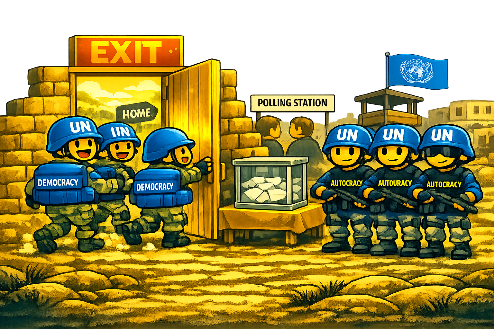

::: {style="text-align:center; margin: 1.5em 0;"}


<p style="font-size: 0.9em; color: gray;">

*Illustration created with AI assistance.*

</p>
:::

Peacekeepers play a vital role in enforcing agreements and promoting stability after a civil war, but participation is costly. While troop-contributing countries may appreciate the material and diplomatic benefits that come with performing this task, they also want to minimize the associated costs and potential downsides of the mission.

We examine troop contributions in post-civil war peacekeeping missions, determining which countries are most prone to withdrawal and when. Drawing from a domestic audience cost perspective, we argue that those countries that are most exposed to political risk from scandals or fiascoes are most apt to flee, viewing post-war elections as identifiable exit points.

Using data on more than 50 peacekeeping operations between 1996 and 2017, we analyze troop contribution dynamics for over 155 different countries to determine whether and when post-war elections prompt peacekeepers to exit. We find evidence that **democratic states** are more likely either to withdraw completely from UN missions or to reduce their contributions by removing peacekeepers from the front lines in the wake of host country elections.

## BibTeX

``` bibtex
@article{Giray2024Election,
  title   = {Election Accomplished: Democracies and the Timing of Peacekeeper Drawdowns},
  author  = {Giray, Burak and Chatagnier, J. Tyson},
  journal = {Political Research Quarterly},
  volume  = {77},
  number  = {1},
  pages   = {3--16},
  year    = {2024},
  doi     = {10.1177/10659129231190614}
}
```
