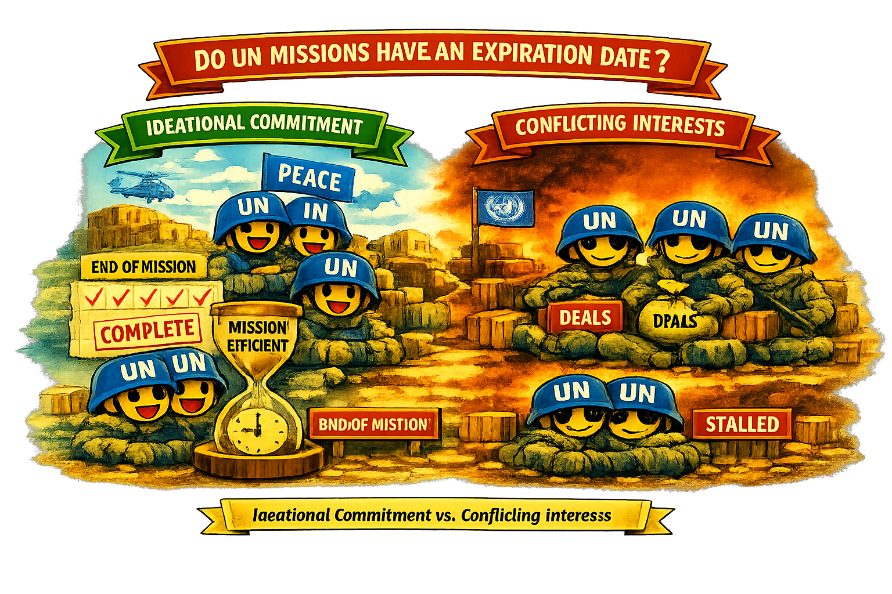

::: {style="text-align:center; margin: 1.5em 0;"}


<p style="font-size: 0.9em; color: gray; margin-top:0;">

<em>Illustration created with AI assistance.</em>

</p>
:::

Private interests might occasionally influence the decisions of troop-providers when contributing to UN peacekeeping missions. However, the pursuit of private benefits impacts how the mandates of peacekeeping missions are fulfilled.

Drawing upon the conflict-of-interest theory, I argue that the effectiveness of UN peacekeeping operations is compromised when troop-providers lack ideational commitment to the principles of UN peacekeeping. This article explores the impact of troop-providers’ ideational commitment to UN peacekeeping on the duration of UN missions. To achieve this, a duration analysis is conducted over all completed and ongoing peacekeeping operations from April 1991 to December 2019.

The results reveal that conflicting interests within peacekeeping operations lead to an increased time required for concluding UN missions. In essence, by establishing a connection between the raison d’être of troop-providers and the duration of missions, this article outlines significant policy implications for the United Nations.

## BibTeX

``` bibtex
@article{giray2024missions,
  title={Do UN missions have an expiration date? Ideational commitment to UN peacekeeping and the length of missions},
  author={Giray, Burak},
  journal={International Peacekeeping},
  volume={31},
  number={1},
  pages={1--28},
  year={2024},
  publisher={Taylor \& Francis}
}
```
